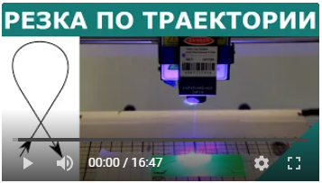

# Inkscape 0.92.x плагин G-code генератор для резки лазером

Это плагин для редактора Inkscape версии 0.92.x предназначенный для генерации Gcode, для лазерной резки.
Плагин руссифицирован.

## Установка

Поместить файлы из папки extensions_ru в папку _inkscape\share\extensions_

## Использование
Выполните команду в Inkscape _Контур / Оконтурить объект_ или _Контур / Оконтурить обводку_

Запустите плагин _Расширения / G-code генератор / G-code для резки лазером_

# Inkscape 0.92.x plugin g-code generator for cutting

This is a plugin for the Inkscape editor 0.92.x for generating Gcode for laser cutting.

## Installation
Copy files from the extensions_en folder into the _inkscape\share\extensions_ folder

## Usage
Run the command in Inkscape _Path / Objects to path_ or _Path / Stroke to path_

Run plugin _Extensions / G-code Generator / G-code for laser cutting_
